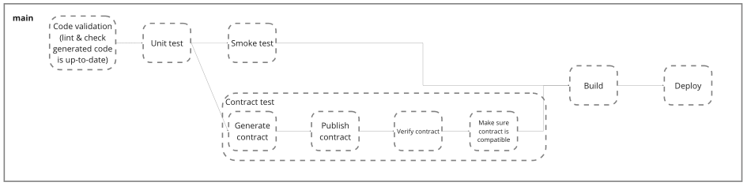

# Contributing

> This guide is for internal Snyk contributors with write access to this repository. If you are an external contributor, before working on any contributions, please first [contact support](https://support.snyk.io) to discuss the issue or feature request with us.

## Prerequisites

You will need the following software installed:

- Git
- Go
    - Use whichever version is in [`go.mod`](./go.mod).

Open a terminal and make sure they are available.

```sh
git --version
go version
```

Also make sure to install the tools required for development by running `make generate`.

## Setting up

Clone this repository with git.

```sh
git clone git@github.com:snyk/code-client-go.git
cd code-client-go
```

You will now be on our `main` branch. You should never commit to this branch, but you should keep it up-to-date to ensure you have the latest changes.

```sh
git fetch
git pull --ff-only
```

## Updating the API clients

In order to update the clients you need access to some private Snyk repositories. Generate a [PAT](https://docs.github.com/en/authentication/keeping-your-account-and-data-secure/managing-your-personal-access-tokens) that is able to read private Snyk repositories and set it in your terminal:

```shell
export GITHUB_PAT=<GITHUB_PAT>
```

Also make sure to have `python3` installed and dependencies:
```sh
brew install python
python3 -m pip install yq --break-system-packages
python3 -m pip install pycurl --break-system-packages
```

Then update `scripts/download-orchestration-api.py` with the latest commit & api version timestamp as found at https://github.com/snyk/orchestration-service/tree/main/src/rest/resources/scans

Then update `scripts/download-workspace-api.py` with the latest commit & api version timestamp as found at https://github.com/snyk/workspace-service/tree/main/src/rest/api/hidden/resources/workspaces

Do a search/replace across files, if the version timestamp has changed to replace all old versions with the new version.

Then run `make tools download-apis` to download the latest code. If you want to download a new version, you can also do that.

Then generate the client by running `make generate`.

## Running tests

### Unit tests

To run the tests run:

```sh
make test
```

If writing unit tests, use the mocks generated by [GoMock](https://github.com/golang/mock) by running `make generate`. 

If you've changed any of the interfaces you may need to re-run `make generate` to generate the mocks again.

### Contract tests

To run the tests run:

```sh
make contract-test
```

These tests use `pact` and the name of each test should start with `TestPact`. The contracts end up in [https://snyk-dev.pactflow.io/](https://snyk-dev.pactflow.io/).

If writing contract tests, use the test implementations in [./internal/util/testutil](./internal/util/testutil) and
make sure that at the top of each file is the following line `//go:build contract`.

These tests are used then in the CI/CD as a gate for the PR and for the release process in `main`.

### Smoke tests

To run the tests make sure to set the `SMOKE_TEST_TOKEN` environment variable to an API key for an org that has the
consistent ignores feature flag enabled.

Then run:

```sh
make smoke-test
```

If writing smoke tests, do not use the test implementations and make sure that at the top of each file is the following line `//go:build smoke`.

The organisation used by the smoke tests is `ide-consistent-ignores-test` in [https://app.dev.snyk.io](https://app.dev.snyk.io) and we are authenticating using a service account api key.

## Code ownership

For current ownership assignments, see: [CODEOWNERS](./.github/CODEOWNERS).

To avoid mixing ownership into a single file, move team-specific logic into separate files. To reduce blockers and save time, design with ownership in mind.

## Code formatting

To ensure your changes follow formatting guidelines, you can run the linter.

```
make lint
```

To fix various issues automatically you can run the following:

```
make format
```

You will need to fix any remaining issues manually.

## Creating a branch

Create a new branch before making any changes. Make sure to give it a descriptive name so that you can find it later.

```sh
git checkout -b type/topic
```

For example:

```sh
git checkout -b docs/contributing
```

## Creating commits

Each commit must provide some benefit on its own without breaking the release pipeline.

For larger changes, break down each step into multiple commits so that it's easy to review in pull requests and git history.

Commits must follow [Conventional Commits](https://www.conventionalcommits.org/en/v1.0.0/) structure:

```
type: summary of your changes

reasoning behind your changes
```

For example:

```
docs: update contributing guide

We often get questions on how to contribute to this repo. What versions to use, what the workflow is, and so on. This change updates our CONTRIBUTING guide to answer those types of questions.
```

### Commit types

The commit type is used to summarize intent and to automate various steps.

| Type       | Description                                     |
| ---------- | ----------------------------------------------- |
| `feat`     | A new user-facing feature.                      |
| `fix`      | A bug fix for an existing feature.              |
| `refactor` | Changes which do not affect existing features.  |
| `test`     | Changes to tests for existing features.         |
| `docs`     | Changes to documentation for existing features. |
| `chore`    | Build, workflow and pipeline changes.           |
| `revert`   | Reverting a previous commit.                    |

## Pushing changes

Once you have committed your changes, review them locally, then push them to GitHub.

```
git push
```

Do not hold onto your changes for too long. Commit and push frequently and create a pull request as soon as possible for backup and visibility.

## Creating PRs

We use a [GitHub Action](https://github.com/marketplace/actions/conventional-release-labels) to generate labels which are then used to generate the release notes when merging the PR.
The title of the PR is what is used to generate the labels.

The following steps run in the CI/CD of a PR and gate the merge:


## Merging PRs

We use a [GitHub Action](https://github.com/marketplace/actions/semver-conventional-commits) to compute the version based on conventional commit messages, push a tag with the computed version, then use
the [GitHub Release CLI](https://cli.github.com/manual/gh_release_create) to generate release notes based on labels.

The following steps run in the CI/CD of the `main` branch and gate the release:
